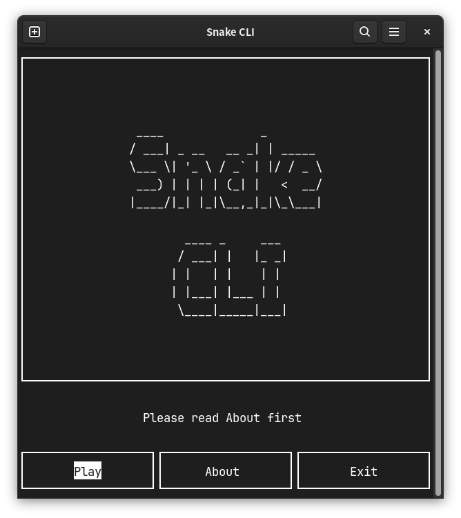
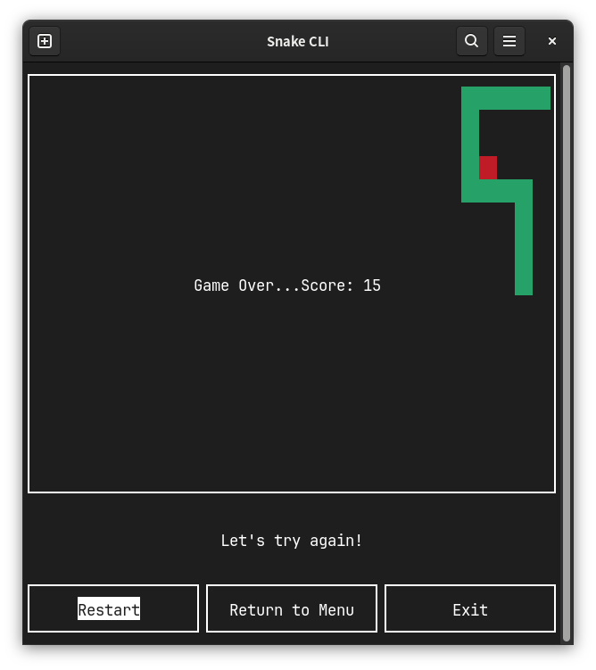

# Snake CLI（终端贪吃蛇）

这是我自己编写的终端贪吃蛇游戏。C23 + ncurses，POSIX 平台。

推荐使用GNU/Linux或MacOS构建运行。

## 游戏截图





## 特性

- 色块渲染：蛇与苹果为实心色块，使用终端调色板语义色，自动适配终端主题
- 正方形格子：双列渲染，横竖方向速度与粗细一致
- 终端环境检查：启动时检查颜色支持与终端尺寸，不满足时给出提示并等待调整
- `-C` / `--check` 参数：实时检查终端尺寸，帮助你找到最佳宽度

## 操作

- 方向键 / WASD：移动蛇；左右方向键切换菜单选项
- Enter：确认
- ESC：暂停游戏 / 退出 About 页

## 构建与运行

依赖：ncurses、CMake ≥ 4.3、支持 C23 的编译器。

> 终端需支持颜色，至少 35×23（宽×高），且列数为偶数；不满足时游戏会在启动时提示并等待调整。注意：Linux TTY 等无法调整大小的终端，若列数为奇数则无法游玩。

```sh
cmake -B build
cmake --build build
./build/snakecli
```

## 架构说明

### 看门狗

本项目引入了看门狗来解决终端缩放问题。SIGWINCH信号通过 `siglongjmp` 使子进程非 0 退出，游戏被看门狗整体重启，变相达到自适应效果，免去了繁琐的轮询判断。

注意：siglongjmp在本项目中仅用于让子进程endwin交还终端后exit，请勿随意更改

### 环境门

进程启动时检查终端环境（颜色支持、最小尺寸 35×23、列数为偶数），不满足时显示原因并阻塞等待：调整终端大小会触发看门狗重启并自动重新检查，按 q 退出。颜色与尺寸是全局前提；宽度奇偶是双列渲染的前提。

### 状态机

- `game.c`：顶层 `MENU / PLAY / EXIT`，`menu()`、`play()` 返回下一状态。
- `play.c`：内部 `PLAY_PLAYING / PLAY_PAUSED / PLAY_FINISHED / PLAY_QUIT`，每状态一函数，返回下一状态；`PLAY_QUIT` 为终态，去向经 `GameState *` 出参传递。

### 窗口布局与所有权

```
+----------------------+
|      main_win        |  游戏区（ter_row - 6 行）
+----------------------+
|     sentence_win     |  提示语（3 行）
+----------------------+
| score_win / 选项菜单  |  底部 3 行：游戏中记分栏，暂停/结算时被选项窗口替代
+----------------------+
```

- 局级资源（score_win，存活整局）：`play()` 创建销毁，状态函数仅有使用权。
- 会话级资源（暂停/结算选项窗口）：状态函数进入时创建、退出时销毁，自产自销。
- 输入模式：各状态函数入口自设 `nodelay`（MENU 阻塞、PLAY 非阻塞轮询），不依赖上游残留；函数内临时切换的（暂停/结算菜单需阻塞输入），退出前恢复。

### 核心数据结构：环形缓冲区

`SnakeCLI.path[CAP]` 记录轨迹：

- `path[0]` 注入初始位置，`step` 从 0 计；每 tick `step++`，写 `path[step % CAP]`
- 蛇身 = 最近 `len` 次写入：`path[(step - i) % CAP]`，`i ∈ [0, len)`
- 不变量 `CAP`为蛇最大长度，胜利长度`CAP - 1`防止越界
- 渲染增量式：每帧只画新头、擦旧尾，蛇身靠屏幕残影绘制

### 渲染：逻辑坐标与色块

- 终端格子高大于宽，直接用字符画会导致纵向断裂、速度不均。本项目以带背景色的空格作为实心色块，横竖无缝。
- 一个逻辑格 = 两个物理列，使格子接近正方形，横竖速度与粗细一致。游戏逻辑全部使用逻辑坐标，`draw_cell()` 是唯一的逻辑→物理映射点。
- 色块与坐标映射都要求终端宽度为偶数，由环境门在启动时保证。

### 苹果生成：枚举法

将地图所有空格集合为新数组，通过`random() % n` 抽取达到随机生成目的。无空格则返回 `{ERR, ERR}` 变相告知胜利。

## 文件结构

```
main.c           看门狗进程（fork / waitpid / 终端修复）
game.c           ncurses 初始化、环境门、SIGWINCH 处理、顶层状态机
menu.c           主菜单（Play / About / Exit，含 Logo 与 About 绘制）
play.c           游戏本体（内部状态机、移动、苹果、渲染与输入）
utils.c          通用辅助（命令行参数、居中打印、选项窗）
game.h / utils.h 共享数据结构与声明
```

---
本项目使用GPL v3协议开源
